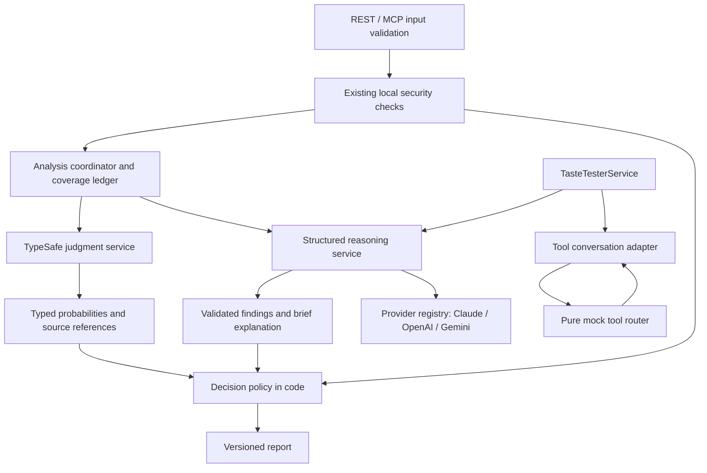

# SPEC — TypeSafe judgments and interchangeable reasoning models

**Status:** Implemented. Explicit local TypeSafe activation is verified through MCP, REST and the native Codex client; see the activation correction below and the [delivery ledger](../implementation/typesafe-progress.md).
**Date:** 2026-09-19. **Baseline:** `2f3a83c266009afa84cc235c43abd7db3d7e6fe3`, package 1.1.0.
**Plan:** [Implementation checklist](../superpowers/plans/2026-09-19-typesafe-model-routing.md).
**Evidence:** [Experiment report](../../experiments/typesafe/REPORT.md), [reproduction instructions](../../experiments/typesafe/README.md).
**Relationship to existing documents:** This is a new feature specification. Root `SPEC.md` and `PLAN.md` remain the historical v1.1 specification and execution record.

## Activation correction

The user's subsequent instruction requires TypeSafe to work in ordinary MCP use, rather than remain disabled behind a research qualification exercise. This correction governs the earlier rollout language below.

- Trusted configuration supports `qualificationPolicy: "required" | "optional"`, defaulting to required for compatibility. Optional activation without an `evaluationFile` permits the implemented enforce/cascade policies and explicitly reports that formal qualification was not performed. It never creates a passing manifest. If an evaluation file is supplied, all existing evidence, identity, expiry and pattern checks remain mandatory under either policy.
- `config/ai.active.json` explicitly enables pinned Jev descriptor/capability/reference enforcement and prompt/skill block-only cascades, with working Gemini reasoning. Strict response validation, complete input handling, source evidence, existing blockers, bounded attempts and clean-path reasoning remain mandatory.
- Trusted `mcpDefaultReportVersion` defaults to 1 for existing configurations. The active configuration sets 2, so ordinary calls to all five versioned MCP tools use the new behavior without extra caller arguments. Explicit version 1 remains available; REST routes retain explicit versions.
- The dedicated MCP launcher anchors the working directory and loads an explicit local credential file. It defaults to the active configuration; no credentials are stored in tracked configuration or client arguments.
- Acceptance for this correction is real TypeSafe responses through MCP and REST, an added security block with exact source evidence, a clean full-reasoning path, cache reuse, model/reference coverage, negative-input checks and actual native-client startup. Independent held-out evaluation remains available as stronger optional assurance; it is not falsely claimed or used to prevent explicitly requested activation.

## 1. Outcome and scope

Prompt Rejector will combine deterministic security mechanisms, TypeSafe's small typed judgments, and configurable reasoning models. An operator must be able to change supported providers or model IDs through validated configuration and a restart, without editing a scanner, prompt template, or decision algorithm.

The first TypeSafe integration is MCP descriptor analysis. Subsequent slices add prompt/skill shadow analysis, capability interpretation and model-reference selection, followed by evaluation-gated enforcement and a bounded reasoning cascade. Claude and OpenAI must be first-class choices; Gemini remains supported for compatibility and comparative evaluation. No provider is declared categorically superior without testing the task and configuration actually deployed.

Included generative roles:

1. `semantic`: contextual prompt/skill analysis and ambiguous descriptor/capability review.
2. `patternDraft`: generation of structured candidate detection patterns from advisories.
3. `taster`: a bounded conversation using only the existing synthetic tools.
4. `monitor`: structured analysis of the Taster's observed behavior.

TypeSafe has a separate `judgment` role. It is not a text generator or a tool-running agent. Role settings are independent; changing the semantic model must not silently change the Taster or Monitor.

Excluded from this delivery: a model-management UI, arbitrary remote provider endpoints, live hot-reload, automatic model shopping, multi-model voting, real execution of Taster tools, multimodal scanning, and replacing CVSS/URL/encoding parsers with inference. TypeSafe advisory relevance and Monitor triage remain future experiments, not release prerequisites. Generative pattern drafting and the full Monitor do gain provider switching in this delivery.

## 2. Evidence and current seams

The exploratory run made 178 TypeSafe calls, approximately $0.0067 at documented rates. Descriptor classification matched all 18 development labels; the first prompt set matched 39/40. Six of eight repeatedly evaluated inputs had some changed answer data. These are development results, not production detection rates or deterministic-output guarantees.

| Existing seam | Required change |
|---|---|
| `src/services/GeminiService.ts:100` accepts `{}` and supplies benign defaults | Require complete runtime-validated results; parse/shape/refusal/truncation failures are not clean judgments. |
| `src/services/SecurityService.ts:79` can return safe when Gemini fails | Centralize explicit decisions and required-check coverage. |
| `src/services/SkillScanService.ts:106` constructs Gemini internally | Inject shared semantic analysis and preserve static, skill-specific, HF and trifecta contributions. |
| `src/services/VulnFeedService.ts:139` depends on Gemini and raw generated JSON | Inject a structured pattern-drafting role; preserve staging and review. |
| `src/services/TasteTesterService.ts:509` uses one Anthropic model for both agents | Separate Taster and Monitor profiles and normalize tool-conversation events. |
| `src/services/McpToolScanner.ts:138` and `TrifectaAnalyzer.ts:258` are synchronous | Retain these local analyzers and wrap them with async semantic orchestrators. |
| `src/services/HuggingFaceService.ts:299` uses proximity heuristics | Fix exact URL/resource parsing first; add optional semantic candidate selection. |
| `src/api/server.ts:17` constructs services at module evaluation | Construct after environment loading; expose an application factory for tests. |
| `src/index.ts` starts REST and MCP through separate construction paths | Build one dependency graph, budget manager, configuration snapshot and provider registry per process. |

## 3. Non-negotiable requirements

- **R1 — deterministic control:** hashes, HMAC, TTL, exact matches, parsing, normalization, schema validation, authorization and final policy composition remain code.
- **R2 — truthful availability:** invalid, refused, incomplete, timed-out or missing required analysis cannot be represented as a negative finding or `safe: true`.
- **R3 — interchangeable providers:** Anthropic, OpenAI and Gemini support all four generative roles, subject to the selected model's declared and tested capabilities. Unsupported combinations fail clearly before calls.
- **R4 — bounded System One:** TypeSafe questions are narrow, independently answerable, versioned and batched over the same relevant state. Source content stays in state, not instructions or criteria.
- **R5 — preserved protections:** no model can lower existing blocking findings, cryptographic failures or raw Taster tool-call severity floors in this rollout.
- **R6 — controlled activation:** TypeSafe starts off for existing installations; explicit shadow mode does not alter decisions. Enforce and cascade require applicable evaluation records.
- **R7 — observable quality:** measure missed risks, false positives, review rate, coverage, availability, repeatability, latency, tokens and estimated cost by task/model/rubric.
- **R8 — compatibility:** version new public reports; never relabel Claude, OpenAI or Jev output as Gemini.
- **R9 — bounded execution:** time, request, token, response-size, concurrency and monetary budgets apply across retries and fallback attempts.
- **R10 — privacy and provenance:** no keys, full production prompts, generated secret material or private provider continuation blocks in default logs. Untrusted claims of authority never become trusted configuration.
- **R11 — no hidden provider execution:** adapters only perform inference. All Taster tool calls terminate in the existing pure mock router.
- **R12 — reversible rollout:** configuration rollback can disable TypeSafe and change model profiles without reintroducing permissive error handling.

## 4. Architecture



Use a small internal adapter layer with native `fetch` and explicit provider request/response types. This avoids forcing incompatible SDK method signatures into the services, avoids automatic tool execution, and adds no model SDK dependency. Existing SDK imports remain only until their call sites and compatibility tests have migrated. Use the current Node >=18 contract and existing TypeScript/ESM/Zod stack; do not accidentally require newer AbortSignal helpers. Test supported syntax/runtime on Node 18.20, 22 and 24; the developer's Node 26 is an additional smoke environment.

The three internal capabilities are separate:

```ts
type ReasoningProviderId = 'anthropic' | 'openai' | 'gemini';
type ProviderId = ReasoningProviderId | 'typesafe';
type FailureCode = 'not_configured' | 'unsupported' | 'authentication' |
  'rate_limited' | 'timeout' | 'cancelled' | 'transport' | 'invalid_response' |
  'refusal' | 'incomplete' | 'context_limit' | 'budget_exceeded';
type CallResult<T> =
  | { status: 'ok'; value: T; meta: CallMeta }
  | { status: 'unavailable'; code: FailureCode; meta: CallMeta };

interface StructuredReasoner {
  generate<T>(request: StructuredRequest<T>, call: CallContext): Promise<CallResult<T>>;
}
interface JudgmentProvider {
  evaluate(request: JudgmentRequest, call: CallContext): Promise<CallResult<JudgmentAnswers>>;
}
interface ToolConversationProvider {
  start(request: ToolSessionRequest, call: CallContext): Promise<CallResult<ToolTurn>>;
  resume(session: ToolSessionHandle, results: ToolResult[], call: CallContext): Promise<CallResult<ToolTurn>>;
  dispose(session: ToolSessionHandle): void;
}
```

Supporting contracts, fully defined in implementation schemas:

| Type | Required contents and invariants |
|---|---|
| `CallContext` | Abort signal, absolute deadline, request/run ID, role, configuration version, budget reservation. Caller cancellation cancels queued and active work. |
| `CallMeta` | Provider, requested model, returned/resolved model when actually supplied (otherwise null), profile/rubric/schema versions, elapsed milliseconds, attempt count, normalized usage, sanitized failure code. No invented resolved model ID. |
| `StructuredRequest<T>` | Trusted system instruction, serialized untrusted state, schema ID/version, JSON Schema and runtime parser for T; max output tokens. Runtime parser has no coercions/defaults that fabricate clean results. |
| `JudgmentRequest` | Model, state and generated question map of Noul/Choice; Score allowed only after a separately versioned rubric needs it. Question IDs and candidate IDs generated by code. |
| `ToolSessionRequest` | Model profile, trusted system instruction, initial user content and bounded tool definitions with runtime input validators. |
| `ToolSessionHandle` | Opaque, in-memory, adapter-owned handle bound to provider, model, run and expiration. Never serialized in public reports or sent to another provider. |
| `ToolTurn` | Session handle, text blocks, bounded valid calls `{id,name,arguments}`, rejected-call evidence `{idOrNull,nameOrNull,reason,argumentExcerpt}`, completeness `complete|partial`, and finish kind `stop|tool_calls|refusal|length|error`; original provider blocks remain private to the adapter. |
| `ToolResult` | Matching call ID, serialized synthetic output and error flag. Duplicate/unknown IDs are rejected. |
| `Usage` | Input/output counts and nullable cached-read, cache-write and reasoning subsets; provider raw numeric usage retained internally. Specify whether a count is a subset to avoid double billing. Missing counts remain null. |

Use the role's configured schema to validate both native structured output and the final normalized object. Provider schema support is a subset of JSON Schema: unsupported constraints may be enforced locally only when their removal does not change meaning; record this mapping explicitly. Never silently weaken enums, required fields, tool input constraints or refusal handling. A schema lacking a supported representation fails capability validation.

A parseable tool-bearing response with mixed valid/rejected calls returns an `ok` ToolTurn marked partial, not an unavailable result that discards the entire turn. Retain bounded observed action names and rejected argument excerpts (maximum 2,000 characters per call, public transcript only, never default logs); all observed known action names contribute their existing severity floor. Only valid calls reach the mock router. Reject every call participating in a duplicate-ID collision. Truncated tool-bearing responses retain parsed evidence and mark partial coverage. An unparseable HTTP body contributes no invented calls; the service still retains earlier completed turns. Unknown tool names are rejected and force review/partial coverage, not an invented safe action.

## 5. Provider mapping and portability

The following signatures were checked against official documentation on the authoring date. Implement fixtures from these APIs; verify again when writing adapters.

| Provider | Structured request | Response/termination handling | Tool loop |
|---|---|---|---|
| OpenAI | `POST /v1/responses`; `model`, `instructions`, `input`, `text.format={type:'json_schema',name,schema,strict:true}`, `max_output_tokens`; `store:false` | Require completed response; inspect refusal/incomplete/error items; extract expected output text, then parse/validate. HTTP code does not use SDK-only `output_parsed` or `output_text` conveniences. | Function definitions use `type:'function',name,parameters,strict`; calls have string JSON `arguments` and `call_id`; results use `function_call_output`. Preserve required reasoning/continuation items privately with `store:false`, including encrypted reasoning when required. If stateless continuation is not supported for a model, reject that Taster profile. |
| Anthropic | `POST /v1/messages`; `model`, `system`, `messages`, `max_tokens`, `output_config.format={type:'json_schema',schema}`; `x-api-key`, `anthropic-version:2023-06-01` | Inspect content blocks and stop reason, including refusal and max-token termination; do not parse thinking blocks as JSON output. Preserve cache-write/read usage separately. | `tools[].input_schema`; `tool_use` blocks contain ID/name/input; return `tool_result` in user content. Keep all provider-required signed thinking/content blocks for continuation. |
| Gemini | `POST /v1beta/models/{model}:generateContent`; `systemInstruction`, `contents`, `generationConfig.responseMimeType='application/json'`, `responseJsonSchema`, `maxOutputTokens`; `x-goog-api-key` header | Inspect prompt blocking, candidate count, finish reason and text parts; never assume `candidates[0]` exists. Use one requested candidate and reject ambiguous multiple outputs. | `functionDeclarations`/`parametersJsonSchema`, `functionCall` and `functionResponse`; preserve full ordered model content and `thoughtSignature` fields. Treat model-specific call IDs as provider data and maintain a checked local mapping. |
| TypeSafe | `POST /v1/systemone`; `{model,state,questions}` and Bearer authentication | Require exact question coverage/types, finite bounded probabilities, valid Choice keys/distributions and expected model identity; Noul has no separate confidence. | Not supported; fail if assigned a generative or Taster role. |

All provider keys go in headers, not URLs. Redirects to another origin are rejected. No caller-provided endpoint or API key is accepted in REST/MCP arguments.

A **model profile** binds provider + model ID + per-model supported options + verified limits. Provider capabilities alone are insufficient: JSON mode is not equivalent to schema-constrained output, and reasoning controls are not universal. Do not send a global `temperature:0`, a universal thinking budget or a provider's cache flags to every model. For example, current GPT-6 Astra guidance disallows temperature/top-p and requires Responses for tool calls. Capability checks must reject unsupported options, not silently ignore them.

Adding a new model within an implemented API should require only a profile and a conformance/evaluation record. Adding a new provider requires an adapter and the same contract suite, without changing scanner logic. Model IDs are configurable strings, not a source-code enum. Unknown IDs can be probed with the explicit diagnostic command but cannot enter enforcement until capability and quality checks pass.

### 5.1 Fallback semantics

Each role has one primary and at most one explicitly configured fallback profile. Fallback occurs for transport/availability/invalid-response conditions if deadline and budget permit. It does not occur merely because a model refused, found risk or returned an inconvenient verdict. Refusal and incomplete reasoning results require review; contradictory successful results require review rather than choosing the most permissive one.

Taster conversations never switch provider/model mid-run. A failed Taster returns a partial transcript and recorded tool evidence; the Monitor may still analyze it. An optional rerun on another profile is a separately requested evaluation run with its own ID and budget. The Monitor may independently use its configured availability fallback because it receives a fixed transcript as data.

## 6. Configuration and changing models

Create validated `config/ai.example.json`; real configurations contain **no secrets**. `AI_CONFIG_PATH` points to a chosen local file. API keys remain in `.env`/environment: `TYPESAFE_API_KEY`, `ANTHROPIC_API_KEY`, `OPENAI_API_KEY`, `GEMINI_API_KEY`.

Schema version 1 configuration uses these top-level keys: `schemaVersion`, `profiles`, `roles`, `typesafe`, `limits`, `pricingFile`, `evaluationFile`. Optional file keys may be omitted when all modes are off/shadow and no monetary live-run budget needs a rate card. Reject unknown configuration keys and role cycles. Load and validate after dotenv; compute a stable nonsecret configuration hash; inject the immutable snapshot.

Example **candidate configuration**, not an already calibrated deployment default:

```json
{
  "schemaVersion": 1,
  "profiles": {
    "claude-security": {"provider":"anthropic","model":"claude-sonnet-5","maxOutputTokens":2048},
    "openai-security": {"provider":"openai","model":"gpt-6-astra","maxOutputTokens":4096,"options":{"reasoning":{"effort":"low"}}},
    "gemini-reference": {"provider":"gemini","model":"gemini-3-flash-preview","maxOutputTokens":2048},
    "claude-taster": {"provider":"anthropic","model":"claude-opus-4-7","maxOutputTokens":4096},
    "claude-monitor": {"provider":"anthropic","model":"claude-opus-4-7","maxOutputTokens":4096}
  },
  "roles": {
    "semantic": {"primary":"claude-security"},
    "patternDraft": {"primary":"claude-security"},
    "taster": {"primary":"claude-taster"},
    "monitor": {"primary":"claude-monitor"}
  },
  "typesafe": {
    "model":"jev-1.13.0",
    "descriptor":"shadow",
    "prompt":"shadow",
    "skill":"shadow",
    "capability":"off",
    "modelReference":"off"
  },
  "limits": {"reasoningTimeoutMs":15000,"judgmentTimeoutMs":2000,"analysisDeadlineMs":20000,"maxConcurrentReasoning":2,"maxConcurrentJudgments":4,"maxQueue":32,"maxInferenceAttempts":{"prompt":3,"skill":6,"descriptor":3,"capability":3},"maxShadowAttempts":3}
}
```

Mode enums are `off|shadow|enforce` for descriptor/capability/modelReference and `off|shadow|enforce|cascade` for prompt/skill. Prompt and skill activation are independent. Inside a skill scan, `typesafe.skill` governs the prompt-risk batch and caps the activation of capability/reference judgments: off disables all optional TypeSafe work; shadow keeps every judgment diagnostic; enforce/cascade permits a child feature to enforce only when that child's own setting and the complete skill route are separately qualified. A child set off stays off. These settings never disable existing deterministic or HF metadata protections. Test the complete parent/child mode table rather than relying on configuration order.

The Claude and OpenAI candidate IDs are documented models as of this date, **not account-access-verified or benchmarked here**. The new setup guide recommends evaluating Claude and OpenAI first, keeps Gemini as the reference, and records the selected winner per role. It makes no assumption that the most expensive flagship is needed for every role.

To switch semantic analysis after validation: change `roles.semantic.primary` from `claude-security` to `openai-security`, run offline config checks and the explicit provider probe/evaluation, then restart. No service code changes. Fallback is opt-in by adding `fallback` to the role; keys do not implicitly enable it. Role-specific model settings may be changed in a profile with the same process.

If `AI_CONFIG_PATH` is absent, synthesize compatibility profiles from existing environment settings: Gemini semantic/pattern drafting; Anthropic Taster/Monitor using `TASTE_TESTER_MODEL`; TypeSafe off. Never auto-select a provider based on which key happens to exist. Explicit configuration supersedes legacy role/model settings and emits only nonsecret deprecation notices. Keep existing `TASTE_TESTER_ENABLED`, turn/token/time caps, canary, feeds, port, mode and pattern settings functional.

Only enabled/referenced providers need keys. Missing credentials make that role unavailable but do not prevent local tools, health or another correctly configured role from starting. Malformed configuration or unsupported enabled capabilities is a startup error. A config-check command identifies missing keys by name without displaying values; disabled Taster and unused profiles do not require credentials.

## 7. Result contract, coverage and public compatibility

### 7.1 Canonical result

New scan reports use `schemaVersion:2` and retain `safe`, `overallSeverity`, categories, findings and timestamp where applicable. They add:

- `decision: 'allow'|'block'|'review'|'unavailable'`; `safe` is **exactly** `decision === 'allow'`.
- `coverage`: one record per required/optional check, status `complete|partial|unavailable|not_requested`, reason code, inspected range/field count and rubric/model provenance.
- `semantic`: normalized reasoning result, provider/model attribution, verdict `benign|suspicious|malicious|undetermined`, required severity/categories/evidence references/brief explanation. Prompt/skill schemas also require `isInjection:boolean` and `selfReportedConfidence:number|null`; the latter is labeled as model self-assessment and never treated as TypeSafe calibration.
- `judgments`: per-question typed answer, source references, rubric/version and provider metadata. Absent or failed analysis is explicitly nullable/unavailable, never a vector of zeroes.
- `analysisMode`, `policyVersion`, `configHash`, `routing` (roles attempted/skipped and why), timings and optional aggregated usage/estimated cost.

No universal “overall confidence” is derived by averaging models. Choice distribution concentration, Noul probability, a reasoner's self-assessment and static evidence have different meanings. Evidence IDs are generated from inspected source fields/spans; an invalid ID invalidates that evidence and triggers review if the conclusion depends on it. All unknown object properties, enums and limits are validated at the public boundary.

Policy precedence:

1. Existing blocking findings or a validated, activated semantic blocking condition → `block`, even if other checks are unavailable; report partial coverage honestly.
2. A completed analysis that explicitly requires contextual adjudication → `review`.
3. A required check could not complete and no earlier blocking/review evidence decides the result → `unavailable`.
4. Only complete required coverage satisfying the task-specific allow matrix below → `allow`.

| Task/mode | Required coverage for allow, absent blocking/review evidence |
|---|---|
| Prompt | Complete local checks and a valid benign reasoning verdict. No TypeSafe-low-score shortcut in any delivered mode. |
| Skill | Complete local/skill checks, valid benign reasoning, resolved required capability assessment and all applicable HF lookups; a zero-reference complete extraction needs no HF network call. Missing capability scope yields review if it matters to the trifecta result; lookup failure/overflow remains incomplete. |
| Descriptor off/shadow | Complete existing local descriptor inspection; allow means no findings within this explicitly reported local scope. Optional shadow results do not affect it. |
| Descriptor enforce | Complete local and semantic inspection, a qualified low-poisoning threshold AND valid `none` evidence answer, or a valid benign reasoning adjudication. Other selections require review under the conservative initial policy; a speculative selection is not itself a logically contradictory or invalid response. This narrower use-case gate is separate from prompt allow-bypass policy. |
| Capability off/shadow | Existing local result is authoritative and identified as declared/local scope; optional inferred unknown states appear only in shadow. |
| Capability enforce | Trusted runtime facts establish at least one absent bucket and thus break the chain, or complete qualified declared/inferred assessments resolve all relevant buckets and are reviewed as necessary. Unknown scope that could complete the chain requires review; no claim of actual runtime safety follows from declared scope alone. |
| Taster/Monitor | The v2 behavior report uses `clean|suspicious|malicious|undetermined` plus completeness/availability, not a global `safe`/`allow` verdict. Only a completed run and valid Monitor can yield clean; unavailable/truncated runs cannot. Preserve raw action severity even when the Monitor refuses or fails. |

In this release, **no low-TypeSafe-score prompt/skill allow bypass exists**. Model refusal, truncation, oversized unseen input, conflicting evidence and missing mandatory checks cannot satisfy item 4. Uncertainty or “not observed” does not mean absent. For standalone capability analysis, an allow result describes only the assessed trifecta and its declared or verified scope, not every possible security risk.

### 7.2 Versioning

- Add `/v2/check-prompt` and `/v2/scan-skill`. Preserve `/v1` response shape when the selected semantic primary/fallback configuration is Gemini-only. Fix v1 unavailable handling to return `safe:false` and an explicit availability/error marker; document this security behavior change.
- Successful v1 mapping uses actual validated Gemini `isInjection`, `selfReportedConfidence`, severity, categories and explanation. Map selfReportedConfidence to `gemini.confidence` and the historical `overallConfidence`/`geminiConfidence`; require it to be numeric for a successful v1 response. Null confidence makes that compatibility response unavailable, not an invented confidence. The unavailable v1 sentinel may retain legacy numeric zero only together with `error:true`, explicit availability false, safe false and an error explanation. Do not derive isInjection from a consequential-action verdict.
- Preserve the historical v1 success decision formula (maximum severity plus isInjection/confidence threshold); the new v2 review/coverage semantics do not silently change successful v1 decisions. Document the unavailable safety correction separately. A malformed successful-looking response is now an unavailable response.
- If a v1 scan cannot truthfully express a configured non-Gemini provider, return HTTP 409 `report_version_required` with the v2 route, **before inference**. Do not make a hidden Gemini call to satisfy a historical field name.
- Preserve the 11 MCP tool names. Add `reportVersion:1|2` to `check_prompt`, `scan_skill`, `scan_mcp_tool`, `check_lethal_trifecta`, and `taste_test`, defaulting to 1 for compatibility. Provider-switching semantic scans require version 2; incompatible v1 requests return an MCP `isError:true` migration response before calls.
- TypeSafe enforcement applies to version 2 reports only. Legacy descriptor/capability/Taster version 1 requests retain their prior local/Anthropic behavior and explicitly remain compatibility paths. Health and migration docs identify this scope; switching enforcement on must not be represented as protecting unmigrated clients. Version 1 Taster is supported only with Anthropic Taster/Monitor profiles; otherwise return `report_version_required` before calls.
- Shadow judgments appear only under a clearly labeled v2 shadow field or sanitized diagnostic record; they never modify `safe`, severity or categories.
- API valid v2 reports, including `review` or `unavailable`, return HTTP 200 with the explicit decision; malformed inputs use 400, size violations 413, incompatible versions 409, and unexpected server bugs 500. An unknown/unavailable analysis is a domain result, not proof of safety. MCP follows the same distinction between a report and a tool/protocol error.
- Introduce these additive v2 interfaces in the next minor release; do not remove v1 or change MCP default version in this work. A later major release can retire them after clients migrate.

## 8. TypeSafe use cases

### 8.1 Descriptor scanning — first integration

Keep `McpToolScanner.scan()` local and deterministic. Add an async `DescriptorAnalysisService` that combines its result with TypeSafe and optional reasoning review.

Code enumerates **all string fields**, including nested schema/example strings, with stable source IDs and paths. Submit the complete descriptor plus field map within limits. Ask a poisoning Noul and speculative Choice over generated IDs plus `none`; option descriptions reference `fields[index].text` and contain no source text. Use the final experiment's source-only-in-state design. Whole-descriptor context is retained to catch relationships across fields.

Implementation-time documentation check: TypeSafe Choice supports at most 255 options. The one-Choice descriptor rubric therefore accepts at most 254 source fields plus `none`, while the public deterministic scan still supports 512 fields. Larger complete descriptors use full-input reasoning fallback or explicit unavailable coverage; never truncate the evidence candidates. A multi-Choice selection scheme requires separate evaluation and is outside this initial rubric.

In shadow mode record disagreements only. In enforce mode a calibrated high-poisoning signal with valid supporting source reference can add a finding; a missing/uncertain reference or contradictory reasoning routes to review. Never remove a static finding. For low-poisoning results, a speculative field selection cannot itself create a malicious finding. The initial conservative enforce policy asks for contextual review when that selection is not `none`; this is a deliberately stricter policy gate, not response invalidity or a logical contradiction between independent primitives. Measure its added review rate/cost before qualification. Low confidence on an unused shadow branch is ignored. A single selected field is an evidence pointer, not a guarantee that every relevant field was found.

### 8.2 Prompt and skill analysis

Begin with the three experimental hazards: weakening instruction hierarchy/persistent policy; disclosure of private data; consequential destructive/payment actions. Retain exclusions for quotation, defensive instructions, harmless roleplay and changes to the user's own earlier request. Revise each rubric independently and freeze versions before evaluation.

The trusted caller envelope may contain input origin and authorized task, but values supplied by untrusted input are only claims. Existing REST/MCP clients without authenticated caller provenance use `origin:'unspecified'`; they cannot self-grant authorization through a new JSON field. Do not automatically treat ordinary skill imperatives as prompt injection; reasoning must consider the source type.

TypeSafe's initial three questions do not cover every existing category. Continue all existing local checks and full reasoning analysis in shadow. In enforce mode they may add validated high-risk findings. In cascade mode code can skip reasoning only after a decisive block; clean-looking inputs still receive reasoning. HF lookups and capability analysis required for `scan_skill` continue even if the prompt rubric alone is benign, unless the request already has a conclusive block and skipped checks are explicitly reported.

### 8.3 Capability interpretation

Preserve `TrifectaAnalyzer.analyze()` and its evidence as a local signal. Add an async wrapper that asks three separate questions about private reads, untrusted input and egress. Include arbitrary GET query strings, fixed external endpoints with arbitrary payloads, offline untrusted uploads, remote-image channels and cloud/private mailbox access.

Represent each capability as `present|absent|unknown`, with evidence provenance `verified_runtime|declared|inferred`. Code uses verified enabled/denied scope directly. Only an injected in-process `TrustedCapabilityResolver`, supplied by trusted host/application configuration, can construct `verified_runtime` facts, bound to agent identity, scope and configuration version. This release does not add a public attestation mechanism: standalone REST/MCP input always supplies declared claims, even if it includes a field named verified. Inference cannot overrule verified permission facts; descriptions and promises cannot establish enforced denial. A bare tool name or missing scope cannot prove absence.

Initial uncertainty strategy: use the three Nouls for supported presence signals and send unresolved buckets to one structured reasoning assessment of the complete configuration. Do not add a speculative sufficiency classifier in this release. Code may establish verified absence from enforced scope; the reasoner may conclude **declared** absence only from explicit complete declared capabilities/restrictions, preserving that weaker provenance. Otherwise the bucket stays unknown. A low Noul cannot by itself create absence. The same whole-skill reasoning call handles these unresolved buckets inside `scan_skill`, rather than launching another reasoner per bucket.

Three present buckets produce critical trifecta evidence. Two present plus one unknown produce `review`, not safe. At least one verified absent bucket breaks this particular chain but does not clear other risk checks. Existing deterministic three-bucket findings remain blocking in this rollout; resolving warning-text false positives requires a later explicitly evaluated policy change.

### 8.4 Hugging Face model references

First use deterministic URL parsing to distinguish model, dataset and Space paths and punctuation. Explicit model URLs remain candidates to audit; TypeSafe cannot erase them. Exact parser corrections may reclassify proven dataset/Space URLs or normalize punctuation; test and measure this separately as a parser-only change. After those validated corrections, preserve every incumbent accepted model reference during semantic trials, including heuristic bare IDs that are not otherwise trustworthy. In off/shadow, authoritative lookups are the corrected incumbent references plus explicit model URLs; semantic additions are diagnostics only and do not launch extra authoritative HF requests. Only qualified enforce mode adds semantic candidates to the authoritative union. Test off/shadow equality when the additional candidate would have returned critical HF flags.

Then enumerate bounded `owner/name` candidates with offsets and surrounding/full relevant state. Ask one Noul per candidate, batched in one request, about whether the exact span names a model repository, including citations and warnings against installation. Copy only candidates already present in the source. Empty candidate sets need no API call. Audit candidates for coverage before claiming improvement.

Initial activation is additive: high-confidence semantic references expand the lookup set; uncertain candidates remain visible for review. A potential saving from dropping false references is a separate future gate. Retain actual HF metadata checks and deduplication. Bound outbound lookups (initial proposal: 16 unique references per scan); overflow marks incomplete supply-chain coverage, never safe-by-omission.

## 9. Bounds, state, caching and budgets

Keep current prompt/skill character limits; add shared REST/MCP schema limits for descriptors and tool arrays. Descriptor defaults: at most 100,000 UTF-16 code units after serialization, 512 string fields and depth 32; reject exceeded structural limits before recursive work or inference. Other public limits must match across transports and have boundary tests.

REST uses an explicit 4 MiB serialized JSON body ceiling, sufficient for supported 500,000-character skills even when JSON-escaped; the stricter task-specific character/schema limits still apply after parsing. Return a consistent 413 for byte or character-size violations. Test ASCII, multibyte and escaped-string boundaries; the Express default body limit must not silently contradict the documented skill limit.

Current Jev documentation distinguishes a 32k state-plus-longest-question budget and 64k total request budget. Prefer an official exact tokenizer/count method when available. Otherwise use a conservative documented preflight (initial: serialized state plus longest question <=24,000 UTF-8 bytes, total serialized request <=48,000 bytes), then treat provider context errors as unavailable. This is intentionally restrictive, not a claim that bytes equal tokens. Larger supported inputs continue through complete local checks and a reasoning profile with sufficient verified context/budget; if none can inspect the full input, return partial coverage/review or unavailable. Do not silently truncate. Context-window chunking is deferred until a separately evaluated cross-chunk policy exists.

All roles have deadlines and output limits. Ordinary v2 scans default to a shared 20-second deadline, TypeSafe 2-second per-call cap and reasoning 15-second per-call cap. Prompt, descriptor and standalone capability scans allow three inference attempts total; skills allow six because prompt, capability and model-reference batches can require three TypeSafe requests plus one mandatory reasoning request, leaving two attempts for retries/fallback. A skill uses at most one logical reasoning assessment over the whole skill plus relevant unresolved evidence, with at most one configured fallback; it does not launch one reasoner per wrapper. Account all retries against these caps. A second attempt never resets the deadline.

Shadow work has a separate optional per-request allowance (at most three calls) and reservation made only after authoritative work has its attempt/spend/capacity allowance. Use a lower-priority queue; shed optional work if it could consume the current request's required allowance or deadline. A missing shadow answer never changes required coverage. Cancel unfinished shadow work at the request deadline; report shadow not-completed instead of blocking the response. Limits are ceilings, not permission to consume the entire monetary budget.

Taster retains fast mode <=2 turns and configured thorough mode <=5 by default; also cap tool calls per turn at 8 and total at 40. Bound the Monitor separately and account for both phases in the run budget. Default combined Taster/Monitor wall-clock ceiling is 60 seconds, preserving the existing 30-second phase caps. Its attempt ceiling is effective Taster turn cap + 2 (one Monitor call and at most one eligible retry/fallback), separate from ordinary scan ceilings.

Retry only transient statuses with Retry-After/backoff if budget permits; no retry on authentication, malformed request, invalid response schema or cancellation. At most one transient retry per logical call, within the total attempt cap. Availability fallback uses the same remaining budget. Disable hidden SDK retries (native fetch avoids them). Queue wait is included in the deadline; full queues return a sanitized unavailable result.

Use a bounded in-memory cache for descriptor/capability judgments only, initially 1,000 entries and 10-minute TTL. Key: exact source hash + model/profile/options + rubric/schema version + trusted context hash + analysis coverage. Cache valid judgments, not final decisions; policy re-evaluates them using its current version. Cache no errors or incomplete coverage. In-flight identical requests coalesce without letting one cancelled waiter cancel another still-live waiter. Each waiter has its own deadline; the underlying call has its own bounded provider deadline, independent of the first waiter's shorter deadline. Abort the underlying call when all waiters leave. Reconcile the single actual inference reservation/usage once using a shared call ID, including when the original waiter cancels. Changes to priorHash affect drift evaluation even if semantic judgment is reused. Do not enable a general sensitive prompt cache by default.

Track per-call/run input/output/cache/reasoning usage and price-table version. Provider totals differ: e.g. OpenAI reasoning tokens are an output subset; Gemini's returned thought count and candidate output need provider-specific billing mapping. Missing usage or price is unknown, not zero. Use conservative pre-dispatch reservations; where neither a rate nor an upper-bound token estimate is available, live evaluation with a monetary cap refuses to run. An account can have a process-local daily cap; document that multiple processes need an external shared cap, which is outside this release.

## 10. Evaluation, rollout and acceptance

The CLI defaults to offline replay. Live runs require explicit `--live`, chosen roles/profiles, a request limit, a USD limit, and a versioned pricing file. It checks keys without displaying them. Default demonstration workload: at most 20 requests and $1; larger runs require explicit higher limits. No API spending is necessary merely to load configuration or start the server.

Implement policy before activating it. The evaluator can construct isolated services with a private evaluation execution context and exercise proposed enforce/cascade policies before a passing manifest exists; otherwise qualification would be circular. This context exists only in the local evaluation runner, cannot be selected through REST/MCP or environment flags on a serving process, and starts no public listener. It retains contract, input, privacy, budget and capability checks, bypassing only the requirement for an already-passing activation manifest. Artifacts are labeled evaluation-only. Production bootstrap always requires matching manifests for enforced modes. First implement/evaluate a task policy, then record qualification, then test staging activation with that manifest.

Use development, calibration and held-out partitions with immutable IDs/hashes. Deduplicate near-identical paraphrase families across partitions. Keep the 107 exploratory inputs as development/regression evidence, not a new held-out benchmark. Store separate labels for malicious intent, consequential action requiring authorization, declared capability and enacted sandbox behavior. Two independent human/agent reviews with adjudication resolve disputed labels; record provenance and do not let the classifier label its own acceptance set.

Required acceptance matrix:

| Gate | Evidence needed before completion |
|---|---|
| Contract/adapter gate | Every supported provider/model role passes mocked native-format fixtures, schema/refusal/truncation/cancellation/budget tests; explicit live probe for the actual selected profile when credentials are available. Missing credentials means live qualification remains pending. |
| Compatibility gate | REST v1/v2 and MCP versions show correct attribution, safe/error behavior, unchanged local tools and strict stdout protocol. No key/endpoint can be injected by request arguments. |
| Shadow gate | Same authoritative decisions with mode off/shadow, sampled eligible judgments present, measured extra latency/cost, bounded cancellation and fallback, no raw-input logs. |
| Descriptor enforcement gate | Separately reviewed held-out descriptor set, at least 200 risky and 200 benign across attack families; zero new missed high/critical known attacks versus the incumbent and no more than 1 percentage point increase in benign blocks. Review rate reported separately so abstention cannot masquerade as accuracy. |
| Prompt cascade gate | Separate held-out prompt AND skill strata of at least 200 risky/200 benign each; same non-regression limits; complete endpoint latency/cost including all checks, fallbacks and reviews. No low-risk auto-allow enabled. |
| Capability/reference gate | Independent bucket/reference labels; unknown/coverage handling validated; all strong deterministic candidates preserved; additive semantic false positives measured separately. |
| Operational gate | Abort and outage drills, config/model switch, stale-cache invalidation, pre/post-restart consistency, rollback, secret redaction and updated documentation. |

These counts are minimum engineering gates, not proof of safety or distributional confidence. Publish confusion matrices and uncertainty intervals only with their sampling assumptions; retain family-level/adversarial failures even when aggregate rates look good. A failed numerical gate leaves the feature in shadow rather than weakening the gate after viewing results.

If thresholds, rubrics or behavior change after inspecting held-out failures, those cases become development/regression evidence and qualification requires a fresh untouched acceptance set. Record the failed run and its provenance; do not relabel it as an independent pass after tuning against it.

Create an evaluation manifest per task with dataset hashes, all decision-affecting primary/fallback profiles and models, model resolution policy, rubric/schema hashes, policy thresholds, pricing version, results, limitations and review date. Enforce/cascade startup requires a matching passing manifest for every permitted decision-affecting route; changing any model/rubric/options invalidates it and requires requalification. An unavailable pinned model falls back only through explicit qualified configuration. Aliases that can drift are permitted for exploration/shadow; enforcement requires a stable model ID or an explicitly documented version-resolution check and expiry.

Deployment progression: off → shadow → descriptor enforce → additive capability/reference enforcement → prompt/skill cascade. Enforce and cascade are task-specific; advancing descriptors does not advance prompts. Roll back by setting task modes off/shadow or selecting a previously qualified reasoning profile and restarting. Reliability fixes stay on. Do not enable production modes or publish a release merely because code tests pass; record the exact completed gate and remaining operational evidence.

## 11. Observability and operational tools

- `ai-config-check`: offline validated effective configuration, roles, missing key names, capability/manifest readiness and nonsecret version hash.
- `ai-probe --live --profile NAME --max-usd N`: one bounded synthetic structured/tool probe as applicable; no production data, tool execution or surprise discovery calls.
- `evaluate-ai`: offline replay and explicit bounded live comparisons across provider/model/rubric profiles; preserve baseline settings and label which outputs are comparable.
- `/health`: retain liveness, add nonsecret configured/ready/degraded role summaries and v2 enforcement scope. No provider inference or secret account lookup on health requests.
- Metrics/logs: role/provider/model/task, source hash where permitted, rubric/policy/config versions, coverage, routing reason, cache hit, timings, attempt counts, unknown usage/cost markers and sanitized failure codes. Errors go to stderr in MCP mode. Opaque continuation state and hidden model reasoning are never logged.

## 12. Delivery file ownership

| Area | Planned files |
|---|---|
| Contracts and validation | `src/ai/contracts.ts`, `src/ai/schemas.ts`, `src/ai/config.ts`, `src/ai/modelProfiles.ts` |
| Transport, scheduling and accounting | `src/ai/transport.ts`, `src/ai/budget.ts`, `src/ai/usage.ts` |
| Providers | `src/ai/providers/GeminiAdapter.ts`, `AnthropicAdapter.ts`, `OpenAIAdapter.ts`, `TypeSafeAdapter.ts`, `src/ai/registry.ts` |
| Application wiring | `src/bootstrap.ts`, `src/index.ts`, `src/api/server.ts`, `src/mcp/mcpServer.ts` |
| Semantic orchestration and policy | `src/services/SemanticAnalysisService.ts`, `JudgmentService.ts`, `DecisionPolicy.ts`, `AnalysisCoverage.ts`, `JudgmentCache.ts`, `TrustedCapabilityResolver.ts` |
| Task-specific wrappers | `src/services/DescriptorAnalysisService.ts`, `CapabilityAnalysisService.ts`, `ModelReferenceAnalysisService.ts`; existing scanners remain local |
| Rubrics and task schemas | `src/ai/rubrics/descriptor.ts`, `prompt.ts`, `capability.ts`, `modelReference.ts`, `src/ai/taskSchemas.ts` |
| Taste-Tester separation | `src/services/tasteTester/MockTools.ts`, `Transcript.ts`; existing `TasteTesterService.ts` orchestrates roles and preserves public compatibility |
| Versioned reports | `src/schemas/AnalysisReportSchemas.ts`, `src/api/reportSerializers.ts` |
| Configuration examples | `config/ai.example.json`, `config/model-capabilities.json`, `config/ai-pricing.example.json`, `.env.example` |
| Evaluation and tests | `src/scripts/checkAiConfig.ts`, `probeAi.ts`, `evaluateAi.ts`, `src/test/ai/`, `src/test/fixtures/ai/`, `evaluations/ai/` |

Avoid a generic workflow engine. Split provider conversation serialization into an adjacent helper only if that adapter becomes difficult to review; do not create an abstraction for every HTTP field. Retain existing service names and APIs where useful; remove temporary Gemini-specific shims only after import and compatibility tests establish no remaining use.

## 13. Sources verified during authoring

- [TypeSafe API](https://docs.typesafe.ai/api.md), [models and limits](https://docs.typesafe.ai/models.md), [confidence](https://docs.typesafe.ai/confidence.md), [known limitations](https://docs.typesafe.ai/model-jaggedness/jev-1.13.md).
- [OpenAI structured outputs](https://developers.openai.com/api/docs/guides/structured-outputs), [function calling](https://developers.openai.com/api/docs/guides/function-calling), [current model guidance](https://developers.openai.com/api/docs/guides/latest-model).
- [Claude structured outputs](https://platform.claude.com/docs/en/build-with-claude/structured-outputs), [Messages API](https://platform.claude.com/docs/en/api/messages), [tool definitions](https://platform.claude.com/docs/en/agents-and-tools/tool-use/define-tools).
- [Gemini structured output](https://ai.google.dev/gemini-api/docs/structured-output), [generateContent API](https://ai.google.dev/api/generate-content), [thought signatures](https://ai.google.dev/gemini-api/docs/generate-content/thought-signatures).

API shapes are documented facts; chosen architecture, caps, thresholds, model candidates, coverage requirements and rollout gates above are proposed project decisions. No new live inference was performed for this specification.
